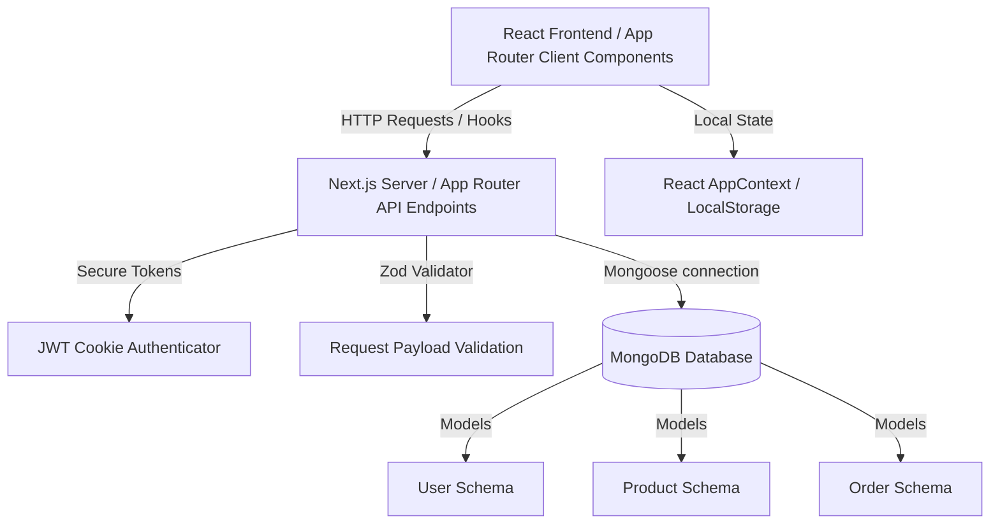

# 🏰 Royal Furniture — Elegant Furniture Hub
> **Enterprise-Grade Luxury E-Commerce Platform**
> A premium, production-ready D2C e-commerce application built on a modern **MERN Stack** utilizing **Next.js 15 (App Router)**, **TypeScript**, **MongoDB**, and **Mongoose**.

---

## 🎨 Luxe Minimalist Philosophy & UI/UX
The user experience matches the brand's luxury identity, following a **"Luxe Minimalist"** design system:
*   **Palette**: A curated mix of deep charcoal (`#1C1917`), warm gold accents (`#C8A97E`), soft sand highlights, and clean typography.
*   **Typography**: *Cormorant Garamond* (an elegant, serif display font) for headings paired with *DM Sans* (a clean, modern sans-serif) for body copies.
*   **Aesthetics**: Glassmorphic sticky menus, micro-animations, lazy loading grids, and a native Dark/Light theme toggle synced with local storage.

### 🌟 Exclusive Features
1. **Multi-Currency Engine**: Real-time currency conversions between `₹ INR`, `$ USD`, and `£ GBP` formatted with local currency formats.
2. **Design Consultation Scheduler**: Customers can request design consultations (In-Store, Virtual, or Home Visit) with an interactive form, managed by admins in the dashboard.
3. **Reviews & Rating Engine**: Integrated verified customer review feeds and star rating forms directly on product detailed pages.
4. **Dynamic Order Tracker**: Interactive timeline progress bar reflecting order fabrication, inspection, and delivery steps dynamically synced from database status updates.
5. **Single-Page Printable Invoices**: Print-media optimized receipt styling ensuring neat, compact outputs.
6. **Robust Responsive Elements**: Fixed inconsistent header spacing gaps dynamically, optimized toast messages, and added backdrop overlays and close icons to the mobile menu drawer.

---

## 🏗️ System Architecture

This application consolidates a full-stack e-commerce engine into a unified **Next.js App Router** deployment:



### 1. Unified Tech Stack
*   **Client Core**: Next.js 15, React 19, TypeScript
*   **Backend Server**: Next.js API Routes, Node.js runtime
*   **Database Engine**: MongoDB via **Mongoose** (Singleton pool mapping)
*   **Validation boundary**: **Zod** (strictly checks payload schemas)
*   **Session Security**: HTTP-Only, SameSite=Strict cookies with encrypted JWT payloads

---

## 🔐 Security Architecture

This platform implements security best practices to defend against common web vulnerabilities (XSS, CSRF, and injection):
*   **Credential Hashing**: User passwords are salted (10 rounds) and hashed with **bcryptjs** before hitting the database.
*   **HTTP-Only Cookies**: JWT tokens are signed using a server-side secret and stored in standard browser cookies configured with `HttpOnly`, `Secure`, and `SameSite=Strict`. This makes session keys inaccessible to JavaScript scripts, protecting the app from XSS token theft.
*   **Server Boundary Validation**: APIs validate incoming request payloads against strict Zod schemas before running database operations, guarding MongoDB against query injection.
*   **Server-Side Role Controls**: All administrative route endpoints verify the JWT cookie role attribute (`'admin'`) directly on the server, ensuring client-side UI modifications cannot bypass administrative permissions.

---

## 🗄️ Database Schemas & Models

The database structure consists of three normalized MongoDB collections with active indexes:

### 1. User Schema (`User`)
Stores user profiles, credentials, and roles.

| Field | Type | Constraints | Description |
| :--- | :--- | :--- | :--- |
| `_id` | ObjectId | Primary Key (auto) | Unique user identification key. |
| `name` | String | Required | Customer's full name. |
| `email` | String | Required, Unique, Indexed | Contact email address used for sign-in. |
| `password` | String | Required | Hashed password string. |
| `role` | String | Enum: `['customer', 'admin']` | User permissions role (defaults to `'customer'`). |
| `createdAt` | Date | Timestamp (auto) | Registration datetime. |
| `updatedAt` | Date | Timestamp (auto) | Last modification datetime. |

### 2. Product Schema (`Product`)
Manages store inventory details, prices, and stats.

| Field | Type | Constraints | Description |
| :--- | :--- | :--- | :--- |
| `_id` | ObjectId | Primary Key (auto) | Unique product identifier. |
| `name` | String | Required | Product display name. |
| `category` | String | Required, Indexed | Furniture type (e.g. `'sofa'`, `'chair'`, `'decor'`). |
| `price` | Number | Required, Min: 0 | Current checkout price in INR. |
| `originalPrice`| Number | Optional, Nullable | Strikethrough retail price for sale items. |
| `image` | String | Required | Static file path or asset URL. |
| `description` | String | Required | Multi-paragraph product copy. |
| `isNew` | Boolean | Default: `false` | Marks if the item is in the "New" collection. |
| `badge` | String | Enum: `['new', 'sale', null]` | Tag badge text displayed on cards. |
| `stock` | Number | Default: `20` | Available warehouse stock quantity. |
| `ratings` | Object | `{ average: Number, count: Number }` | Review ratings metrics (defaults to `5.0` stars). |

### 3. Order Schema (`Order`)
Tracks transactional shopping sessions and delivery progress.

| Field | Type | Constraints | Description |
| :--- | :--- | :--- | :--- |
| `_id` | ObjectId | Primary Key (auto) | Unique transaction ID. |
| `user` | ObjectId | Ref: `'User'`, Indexed | Associated buyer profile ID. |
| `items` | Array | Ref: Inline Item Schema | Ordered items (Product ID, Name, Price, Quantity). |
| `totalAmount` | Number | Required | Total billing amount for checkouts. |
| `status` | String | Enum: `['Pending', 'Processing', 'Shipped', 'Delivered']` | Shipping progress status (defaults to `'Pending'`). |
| `shippingAddress`| Object | Schema: Custom Address | Recipient contact info (Name, Phone, Email, Address, Zip). |
| `createdAt` | Date | Timestamp (auto) | Timestamp of purchase completion. |

---

## 🔌 API Route Specifications

All endpoints return unified, structured JSON payloads:

### Public Endpoints
| Route | Method | Payload | Auth | Description |
| :--- | :--- | :--- | :--- | :--- |
| `/api/auth/register` | `POST` | `{ name, email, password }` | None | Registers a new account and sets a JWT session cookie. |
| `/api/auth/login` | `POST` | `{ email, password }` | None | Authenticates user credentials and signs a JWT cookie. |
| `/api/auth/logout` | `POST` | None | None | Clears the session auth cookie. |
| `/api/products` | `GET` | Query: `?category`, `?search` | None | Returns products matching search queries and category filters. |
| `/api/products/[id]` | `GET` | Dynamic Path ID | None | Fetches detailed metrics for a single product. |

### Secured Customer Endpoints
| Route | Method | Payload | Auth | Description |
| :--- | :--- | :--- | :--- | :--- |
| `/api/auth/me` | `GET` | None | Customer | Returns profile details for the logged-in user. |
| `/api/orders` | `GET` | None | Customer | Lists order history for the authenticated user. |
| `/api/orders` | `POST` | `{ items, shippingAddress }` | Customer | Places a new order, validates stock, and updates inventory. |

### Secured Admin Endpoints (Privileges Verified on Server)
| Route | Method | Payload | Auth | Description |
| :--- | :--- | :--- | :--- | :--- |
| `/api/products` | `POST` | `{ name, price, category, image, description, stock }` | Admin | Appends a new product to the catalog. |
| `/api/products/[id]` | `PUT` | `{ name, price, description, stock, badge }` (Partial) | Admin | Modifies details of an existing product. |
| `/api/products/[id]` | `DELETE` | Dynamic Path ID | Admin | Removes a product from the database catalog. |
| `/api/admin/orders` | `GET` | None | Admin | Retrieves all orders across the entire customer database. |
| `/api/admin/orders` | `PUT` | `{ orderId, status }` | Admin | Updates order shipping status (e.g. `'Shipped'`). |
| `/api/admin/users` | `GET` | None | Admin | Lists registered customer database profiles. |
| `/api/admin/stats` | `GET` | None | Admin | Calculates total earnings, stock size, user count, and recent orders. |

---

## 🖥️ Page Routing Matrix

The frontend uses Next.js App Router routes:

| Route Path | Access | Components Rendered | Key Features |
| :--- | :--- | :--- | :--- |
| `/` | Public | Header, HeroSlider, Gallery, Reviews, Footer | Home page featuring trust badges, animated stats, and curated picks. |
| `/product` | Public | Header, ProductCard, Search bar, Filters, Footer | Complete catalog with category search and real-time text matching. |
| `/product/[id]` | Public | Header, ProductCard, Related products, Footer | Full product specifications, stock levels, and recommendations. |
| `/signup` | Public | AuthLayout, Login Form, Password checker | Authentication portal with validation checks. |
| `/admin/login` | Public | AuthLayout, Admin Form | Admin portal access point. |
| `/admin/dashboard` | Admin Guard | Admin Sidebar, Stats Grid, Table Views, Add Modal | CRUD controls, transaction trackers, status dropdowns, and metrics. |

---

## ⚡ Local Setup & Installation

### 1. Clone & Clean
Clone the repository and install the dependencies:
```bash
git clone https://github.com/Abdurrehman510/Elegant-Furniture-Hub.git
cd Elegant-Furniture-Hub
npm install
```

### 2. Configure Environment Variables
Create a `.env.local` file in the root directory to store connection keys:
```env
MONGODB_URI=mongodb://127.0.0.1:27017/royal-furniture
JWT_SECRET=royal-furniture-super-secure-key-change-in-production
```

### 3. Seed Database
Execute the database seed script to insert initial products and the administrator account:
```bash
npx tsx scripts/seed.ts
```

### 4. Run Servers

*   **Development environment**:
    ```bash
    npm run dev
    ```
    Access the store at [http://localhost:3000](http://localhost:3000).

*   **Production build compilation**:
    ```bash
    npm run build
    npm run start
    ```

---

## 🔑 Administrative Access Credentials
Use these seeded credentials to access the administrative control console:
*   **Link**: `/admin/login` (or click **Admin** in the footer)
*   **Email**: `admin@royalfurniture.com`
*   **Password**: `password123`
